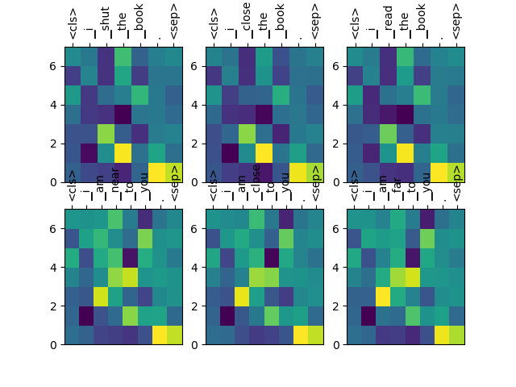
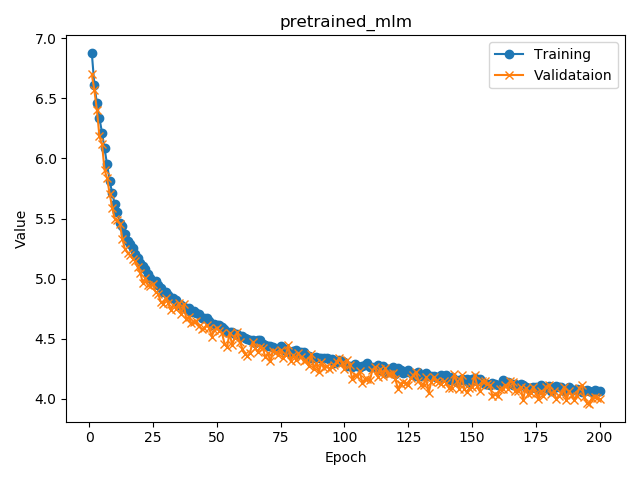
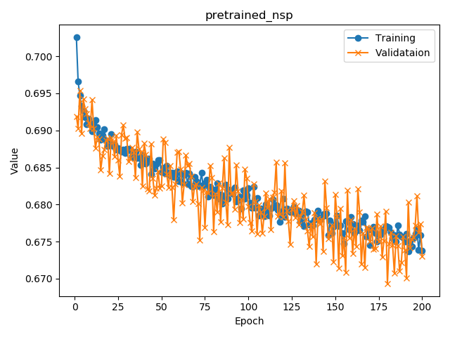

# 1. Accuracy on IMDB test set
Acc = (True positive + True negative) / No. of test sentences
| Model                   | Acc |
|-------------------------|-----|
| With pretrained BERT    | 82% |
| Without pretrained BERT | 78% |

# 2. Training set
* IMDB training set (35.4MB, 1,222 supervised sentences) is used for both training pretrained BERT and fine-tuning for sentiment classification.
* Yes. It will give better result if BERT is pretrained on bigger, unlabeled DB.

# 3. Features

1. Subword representation: sentencepiece from Google
* However, BPE is also manually implemented and it is helpful for understanding the BPE if you followed the code of bpe.py
2. Pytorch implementation of BERT
3. BERT training code for masked language model and next sentence prediction
4. Fine-tuning code for the task of sentence clasification using IMDB

# 4. Analysis

1. Visualization of subword representations learned by BERT by PCA on 7 top dimensions of hidden states

2. Cosine similarity of **bold words** in same or different context (verifying the contextual representation of BERT)

| No. | Word 1                | Word 1                 | Cosine similarity |
|-----|-----------------------|------------------------|-------------------|
| 1   | I **shut** the book.  | I **close** the book   | 0.9978            |
| 2   | I **close** the book. | I **read** the book    | 0.9763            |
| 3   | I am **near** to you. | I am **close** to you. | 0.9863            |
| 4   | I am **close** to you | I am **far** to you.   | 0.9719            |
| 5   | **I** shut the book   | **I** am near to you.  | 0.9634            |
| 6   | I **close** the book  | I am **close** to you. | -0.1844           |

3. Learning curve

